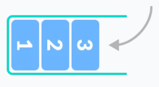

# Pilha
São estrutura de dados lineares que seguem o princípio de LIFO - *lastin, first out* - assim, o último elemento inserido é o primeiro a ser removido, pois funciona como uma pilha de pratos.

### Operações
Numa pilha pode-se realizar as seguintes operações com os elementos e com a estruturas:
- **inserir** um elemento - `push()` 
- **remover** um elemento - `pop()` 
- **Topo** / `Peak()`,  pegar o valor do elemento no topo da pilha sem remove-lo
- **Vazia** / `isEmpty()`, verficar se uma pilha está vazia
- **Cheia** / `isFull()`, verificar se uma pilha está cheia

### Na programação
Um ponteiro `top` é usado para *keep track* do elemento no topo da pilha. Quando a pilha é inicializada, o valor do `top` é `= -1` para indicar que a pilha está vazia e ele funcionará como índice do topo da pilha.

Então, ao inserir elemento o valor do `top` é aumentado, ao remover diminuído e ele pode ser usado para saber se a pilhas está cheia ou vazia, o que deve ser verificado antes das operações de inserção ou remoção.

Pode ser implementada com **vetores** ou **listas**

### Representação
Vizualiza-se uma pilha como algo na vertical, com seu topo em cima. Mas na programação, é como ela estivesse tombada na horizontal com seu topo para direita, final do vetor ou lista. 

#### Aplicações
Utilizada para ***Fazer reverse de palavras***, em ***Compiladores*** e em ***Navegadores***, por exemplo.

#### Stack Time Complexity
For the array-based implementation of a stack, the push and pop operations take constant time, i.e. O(1).